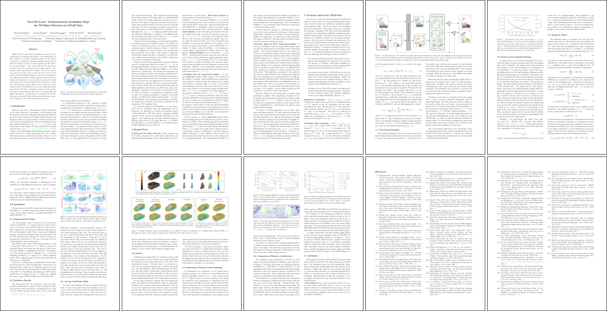

<p>
<center><a href="https://dschinagl.github.io">David Schinagl</a>&nbsp;&nbsp;&nbsp;&nbsp;&nbsp;
<a href="https://scholar.google.at/citations?user=Vt2vlgIAAAAJ&hl=de">Georg Krispel</a>&nbsp;&nbsp;&nbsp;&nbsp;&nbsp;
<a href="https://snototter.github.io/research/">Horst Possegger</a><br>
<a href="https://scholar.google.at/citations?user=CgboCBAAAAAJ&hl=de">Peter M. Roth</a>&nbsp;&nbsp;&nbsp;&nbsp;&nbsp;
<a href="https://scholar.google.com/citations?user=_pq05Q4AAAAJ&hl=de">Horst Bischof</a></center>
</p>

<p>
<center><span style="color:#3A9700">CVPR 2022</span><br>
<span style="color:#3A9700">New Orleans</span>
</center>
</p>

<p>
<center>Graz University of Technology</center>  
<center>Institute of Computer Graphics and Vision</center>
</p>

<p>
<center><a href="">[Paper]</a>&nbsp;&nbsp;&nbsp;&nbsp;&nbsp;
<a href="https://github.com/dschinagl/occam">[Code]</a></center>
</p>
<br>

---

<center>

</center>
<br>
Our attribution maps or saliency maps show the importance of individual LiDAR 3D points for the black-box detection model’s decisions.
<br>

---

## Abstract
While 3D object detection in LiDAR point clouds is well-established in academia and industry, the explainability of these models is a largely unexplored field.	In this paper, we propose a method to generate attribution maps for the detected objects in order to better understand the behavior of such models.	These maps indicate the importance of each 3D point in predicting the specific objects. Our method works with black-box models: We do not require any prior knowledge of the architecture nor access to the model's internals, like parameters, activations or gradients. Our efficient perturbation-based approach empirically estimates the importance of each point by testing the model with randomly generated subsets of the input point cloud. Our sub-sampling strategy takes into account the special characteristics of LiDAR data, such as the depth-dependent point density. We show a detailed evaluation of the attribution maps and demonstrate that they are interpretable and highly informative. Furthermore, we compare the attribution maps of recent 3D object detection architectures to provide insights into their decision-making processes.
<br>

---

## Paper
<center>

</center>
<br>

---
## Citation

If you find this code useful for your research, please cite

```
@inproceedings{Schinagl2022OccAM,
  title={OccAM's Laser: Occlusion-based Attribution Maps for 3D Object Detectors on LiDAR Data},
  author={Schinagl, David and Krispel, Georg and Possegger, Horst and Roth, Peter M. and Bischof, Horst},
  booktitle={Proceedings of the IEEE Conference on Computer Vision and Pattern Recognition},
  year={2022}
}
```
