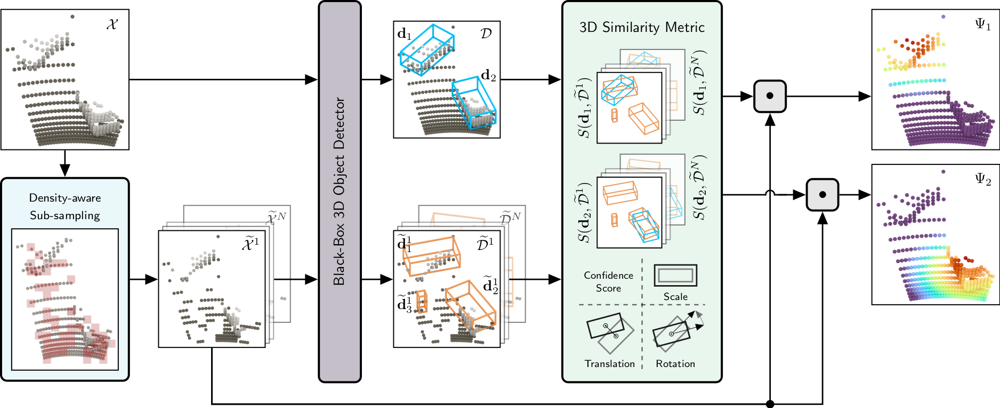
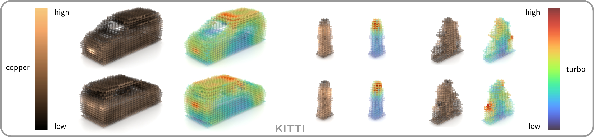

<p>
<center><a href="https://dschinagl.github.io">David Schinagl</a>&nbsp;&nbsp;&nbsp;&nbsp;&nbsp;
<a href="https://scholar.google.at/citations?user=Vt2vlgIAAAAJ&hl=de">Georg Krispel</a>&nbsp;&nbsp;&nbsp;&nbsp;&nbsp;
<a href="https://snototter.github.io/research/">Horst Possegger</a><br>
<a href="https://scholar.google.at/citations?user=CgboCBAAAAAJ&hl=de">Peter M. Roth</a>&nbsp;&nbsp;&nbsp;&nbsp;&nbsp;
<a href="https://scholar.google.com/citations?user=_pq05Q4AAAAJ&hl=de">Horst Bischof</a></center>
</p>

<p>
<center><span style="color:#3A9700">CVPR 2022</span><br>
<span style="color:#3A9700">New Orleans</span>
</center>
</p>

<p>
<center>Graz University of Technology</center>  
<center>Institute of Computer Graphics and Vision</center>
</p>

<p>
<center><a href="https://openaccess.thecvf.com/content/CVPR2022/papers/Schinagl_OccAMs_Laser_Occlusion-Based_Attribution_Maps_for_3D_Object_Detectors_on_CVPR_2022_paper.pdf">[Paper]</a>&nbsp;&nbsp;&nbsp;&nbsp;&nbsp;
<a href="https://github.com/dschinagl/occam">[Code]</a></center>
</p>

---

<center>
<a href="images/teaser.jpg">

</a>
</center>
<br>
Our attribution maps or saliency maps show the importance of individual LiDAR 3D points for the black-box detection model’s decisions.
<br>

---

## Abstract
While 3D object detection in LiDAR point clouds is well-established in academia and industry, the explainability of these models is a largely unexplored field.	In this paper, we propose a method to generate attribution maps for the detected objects in order to better understand the behavior of such models.	These maps indicate the importance of each 3D point in predicting the specific objects. Our method works with black-box models: We do not require any prior knowledge of the architecture nor access to the model's internals, like parameters, activations or gradients. Our efficient perturbation-based approach empirically estimates the importance of each point by testing the model with randomly generated subsets of the input point cloud. Our sub-sampling strategy takes into account the special characteristics of LiDAR data, such as the depth-dependent point density. We show a detailed evaluation of the attribution maps and demonstrate that they are interpretable and highly informative. Furthermore, we compare the attribution maps of recent 3D object detection architectures to provide insights into their decision-making processes.
<br>

---

## Paper

[[Paper & Supp. (arXiv)]](https://arxiv.org/pdf/2204.06577.pdf)
<a href="https://arxiv.org/pdf/2204.06577.pdf">

</a>
<br>

---

## Method Overview

OccAM overview. We consider the specific point cloud  characteristics during the sub-sampling of the input point cloud, such that the black-box 3D object detectors are challenged appropriately for all sensing ranges. Using a similarity metric tailored for this task, we can precisely analyze the changes in the detection output to obtain highly expressive attribution maps.

<a href="images/method_overview.png">

</a>
<br>

---

## Example Results

Attribution map examples for [PointPillars](https://openaccess.thecvf.com/content_CVPR_2019/html/Lang_PointPillars_Fast_Encoders_for_Object_Detection_From_Point_Clouds_CVPR_2019_paper.html) detections on [KITTI](http://www.cvlibs.net/datasets/kitti/). Warmer colors (turbo colormap) denote higher contribution of a point to this detection. Crops are for visualization only.

<a href="images/example_results.png">

</a>
<br>

---

## Attribution Map Progression Example
<center>
<br>
</center>

---

## Average Attribution Maps

Average attribution maps (turbo-colored) for PointPillars trained and evaluated on the KITTI dataset. We also show the average LiDAR reflectivity / intensity values (copper-colored). From left to right: cars, pedestrians and cyclists.

<a href="images/average_attribution.png">

</a>
<br>

---

## Citation

If you can make use of this work, please cite:

```
@InProceedings{Schinagl_2022_CVPR,
    author    = {Schinagl, David and Krispel, Georg and Possegger, Horst and Roth, Peter M. and Bischof, Horst},
    title     = {OccAM's Laser: Occlusion-Based Attribution Maps for 3D Object Detectors on LiDAR Data},
    booktitle = {Proceedings of the IEEE/CVF Conference on Computer Vision and Pattern Recognition (CVPR)},
    month     = {June},
    year      = {2022},
    pages     = {1141-1150}
}
```
